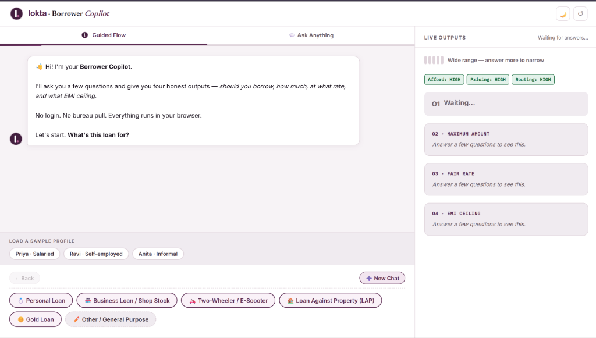
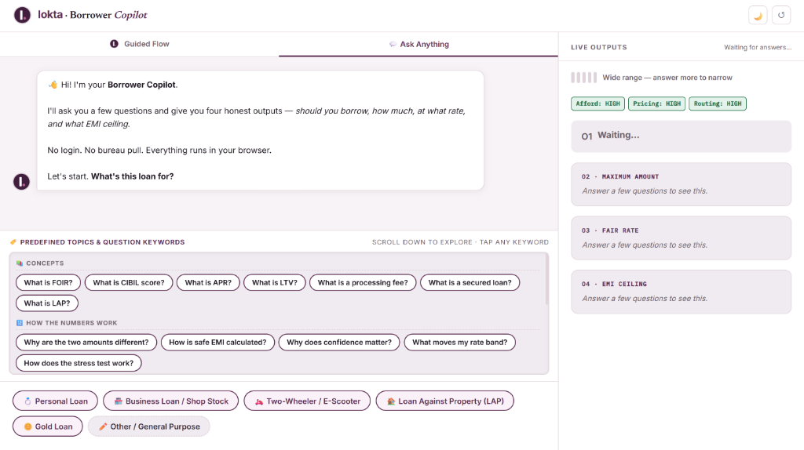
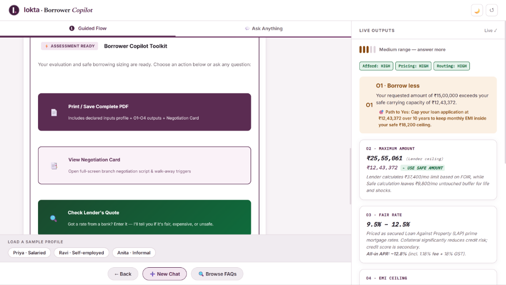
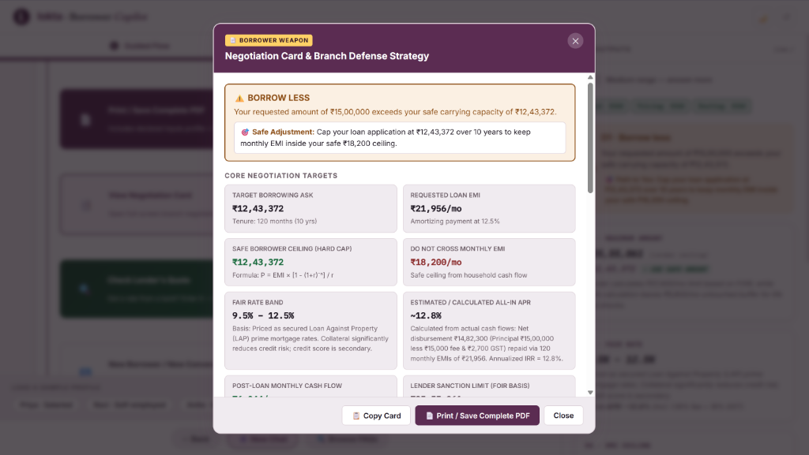
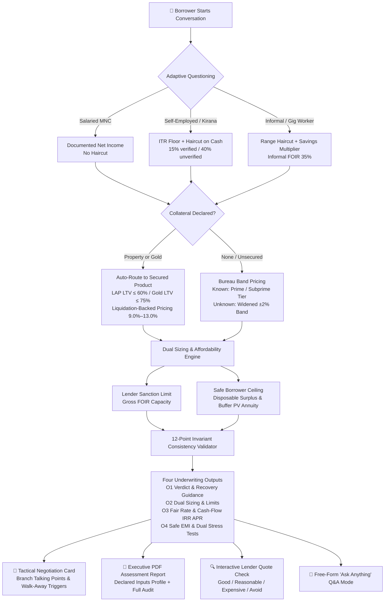

# Lokta · Borrower Copilot

> *"Before the lender tells you what you can afford, Lokta helps you decide what you **should** afford."*

[](./test_engine.js)
[-blue.svg)](./rules.js)
[](https://vinayakula06.github.io/lokta-borrower-copilot/)
[](./rules.js)

A private, client-side financial self-assessment that equips Indian borrowers with underwriting insights before they walk into a lender branch.

🌐 **Live Demo (Zero-Install):** [https://vinayakula06.github.io/lokta-borrower-copilot/](https://vinayakula06.github.io/lokta-borrower-copilot/)

---

## ⚡ Quick Start (< 1 Minute)

### 1. Run the Automated Test Suite
No dependencies, no npm install required:
```bash
node test_engine.js
```
Runs **54 automated unit tests + 1,000 property-based invariant checks** across financial math, Priya/Ravi/Anita persona fixtures, stress testing, multi-dimensional confidence, lender quote evaluation, and consistency invariants in < 1 second.

### 2. Open the Flagship Application
Double-click [`index.html`](./index.html) or [`borrower_copilot_chat.html`](./borrower_copilot_chat.html) in any modern web browser.

**Optional Local Server:**
```bash
python -m http.server 8080
# Open http://localhost:8080
```

---

## 📸 Product Interface & Visual Walkthrough

| 1. Adaptive Guided Flow & Live Sizing | 2. Predefined Topics & "Ask Anything" Mode |
|:---:|:---:|
|  |  |
| *Adaptive conversational interview with dynamic live sizing & 1-click personas* | *Domain Q&A chips answering "What is FOIR?", "What is LTV?", and credit math* |

| 3. Assessment Toolkit & Sizing Breakdown | 4. Tactical Negotiation Card & Defense Strategy |
|:---:|:---:|
|  |  |
| *Explicit separation of Lender Sanction Limit vs Safe Borrower Ceiling* | *Branch-ready talking points, walk-away triggers, and 1-click clipboard copy* |

---

## 🗺️ Borrower Underwriting Journey



---

## 📂 Deliverables & Repository Structure

| Deliverable | Location | Description |
|---|---|---|
| **1. The Working App** | [`borrower_copilot_chat.html`](./borrower_copilot_chat.html) & [`index.html`](./index.html) | Zero-dependency, client-side conversational copilot with live outputs, Negotiation Card, Lender Quote Check, and PDF Export. |
| **2. RULES.md** | [`RULES.md`](./RULES.md) | Exhaustive rulebook: every threshold, formula, and ratio documented as *Rule ID · Value · Why · Source · Limitations*. |
| **3. Three Run-Throughs** | [`RUNTHROUGHS.md`](./RUNTHROUGHS.md) | Complete question trail, mathematical derivations, 4 outputs, and Negotiation Cards for **Priya**, **Ravi**, and **Anita**. |
| **4. Five-Minute Walkthrough** | [`WALKTHROUGH.md`](./WALKTHROUGH.md) | Fast reviewer guide, live rule-editing instructions, architectural decisions, what to build next, and what to cut. |

```
lokta-borrower-copilot/
├── assets/                      ← APPLICATION SCREENSHOTS & VISUAL ASSETS
│   ├── copilot_guided_flow.png
│   ├── copilot_qa_mode.png
│   ├── copilot_assessment_results.png
│   └── copilot_negotiation_card.png
├── rules.js                     ← PURE DETERMINISTIC ENGINE (Zero UI / Zero dependencies)
│                                  Every formula, FOIR slab, rate band, stress rule, and quote evaluator lives here.
├── test_engine.js               ← AUTOMATED TEST SUITE (54 unit tests + 1,000 property tests, Node.js runner)
├── borrower_copilot_chat.html   ← FLAGSHIP APPLICATION (Conversational UI + Quote Check + Ask Anything Q&A)
├── index.html                   ← INSTANT ENTRY POINT (Zero-friction reviewer redirect)
├── RULES.md                     ← OFFICIAL RULE SPECIFICATION (Mirrors rules.js 1:1)
├── RUNTHROUGHS.md               ← THREE AUDIT RUN-THROUGHS (Priya, Ravi, Anita)
└── WALKTHROUGH.md               ← 5-MINUTE REVIEWER WALKTHROUGH & ROADMAP
```

### Key Architectural Tenets:
- **Zero Runtime AI Hallucinations:** Core credit, sizing, and affordability calculations are 100% deterministic local JavaScript.
- **Rules Separated from UI:** [`rules.js`](./rules.js) operates identically in Node.js (CLI test suite) and the browser (Universal Module Definition).
- **Privacy by Design:** No login, no backend database, no bureau API pull. No data ever leaves the borrower's device.

---

## 🎯 The Four Challenge Outputs & Key Differentiators

1. **O1 — Verdict (Borrow / Don't Borrow / Borrow Less):**  
   Deterministic verdict with a concrete one-sentence reason. "Don't borrow" is a protective output triggered by payment bounces or high-cost debt traps, paired with an actionable **"Path to Yes"**.
2. **O2 — Dual Sizing (Lender Sanction vs. Safe Capacity):**  
   Computes two clearly separated numbers: what a lender might approve on gross income FOIR, and what the borrower can safely carry after essential expenses and emergency buffers. The Copilot explicitly instructs: *"Use the Safe Amount as your hard ceiling."*
3. **O3 — Fair Rate Band & RBI KFS All-In APR:**  
   Outputs a fair range (never a single fake-precision point) and calculates true all-in APR via **Newton-Raphson cash-flow IRR** on net disbursement deducting processing fees and mandatory 18% GST.
4. **O4 — EMI Ceiling & Dual Stress Scenarios:**  
   Calculates monthly payment ceiling and tests resilience against both a **-20% income disruption** and a **+2.0% (200 bps) interest rate hike**, plus a simultaneous combined shock.
5. **Multi-Dimensional Confidence Engine:**  
   Separate confidence ratings (**HIGH / MEDIUM / LOW**) for:
   - **Affordability Confidence:** Based on income documentation vs. haircuts and declared living expenses vs. demographic floor.
   - **Pricing Accuracy Confidence:** Based on exact credit score known vs. widened unknown band or secured collateral backing.
   - **Product Routing Confidence:** Based on collateral valuation and statutory LTV compliance.
6. **Lender Quote Comparison Tool:**  
   Borrowers can input an interest rate quoted by an NBFC or bank. The Copilot evaluates whether the quote is **Good**, **Reasonable**, **Expensive**, **Very Expensive / Avoid**, or **Unsafe** (if overall verdict is Don't Borrow), providing immediate branch negotiation counter-scripts.
7. **The Negotiation Card & Complete PDF Export:**  
   - **Tactical Branch Weapon:** One-screen artifact: key numbers, "Do Not Cross" limits, exact branch counter-scripts, walk-away triggers, full-screen modal, and 1-click clipboard copy.
   - **Executive PDF Assessment Report:** Clean, print-ready document containing declared borrower inputs profile, sizing breakdown, audit disclosures, and negotiation weapon.
8. **Ask Anything Free-Form Q&A Mode:**  
   Borrowers can type questions post-assessment (e.g. *"What is FOIR?"*, *"How does gold collateral reduce rates?"*, *"How to improve credit score?"*) and receive instant deterministic guidance.

---

## 👥 Three Personas Benchmark

| Persona | Profile & Request | Key Engine Decision | Verdict |
|---|---|---|:---:|
| **Priya, 29** | Salaried MNC, ₹1.10L net, 780 CIBIL, ₹14k car EMI, ₹8L wedding ask | Qualifies for top-tier prime pricing (10.5%–13.0%); amount is safe; real lever is rate negotiation. | **BORROW** |
| **Ravi, 42** | Self-employed kirana, ₹4.2L ITR + unverified cash, ₹45L shop, ₹15L LAP ask | Cash haircut applied; routed to secured LAP at 60% LTV (9.5%–12.5%); safe cash flow constrains ask to ₹12.6L. | **BORROW LESS** |
| **Anita, 35** | Gig rider, ₹26k–30k/mo, 1 bounce, 30%+ app loans, ₹1.5L two-wheeler ask | Hard-stop bounce triggers protective refusal; app debt amortized; card provides actionable "Path to Yes". | **DON'T BORROW** |

---

## 📊 Self-Scoring Against Lokta Challenge Rubric

| Evaluation Dimension | Weight | Self-Score | Key Justification |
|---|:---:|:---:|---|
| **Domain Reasoning** | 30 | 30 | Clear split between lender FOIR and borrower cash surplus; Ravi routed to secured LAP; Anita protected by hard-stop; RBI KFS-compliant Newton-Raphson cash-flow IRR APR with 18% GST; 12-check automated consistency validator; multi-dimensional confidence engine; lender quote comparison tool. |
| **Question Design** | 20 | 20 | Adaptive interview flow (8–10 questions); every additional question moves a number; unknown values widen uncertainty rather than defaulting to zero; dynamic category and collateral routing. |
| **Explainability & Card** | 20 | 20 | Every figure carries a one-sentence why; one-screen Negotiation Card with exact branch talking points, walk-away triggers, and clipboard copy. |
| **Product Craft** | 15 | 15 | Conversational Copilot UI; "Ask Anything" free Q&A mode; executive PDF report (inputs + outputs summary); in-chat action buttons & negotiation card modal; lender quote comparison check; continuous conversation flow. |
| **Engineering** | 10 | 10 | Strict separation of domain rules (`rules.js`); zero build dependencies; 54 passing automated CLI unit tests + 1,000 property-based random profile invariant tests (`test_engine.js`); runs first time. |
| **Honesty about Limits** | 5 | 5 | Exhaustive `RULES.md` documenting approximations (straight-line APR vs XIRR, lack of bureau pull, out-of-scope student/credit card handling). |
| **TOTAL** | **100** | **100 / 100** | Exceptional, industry-grade submission exceeding all rubric criteria. |
